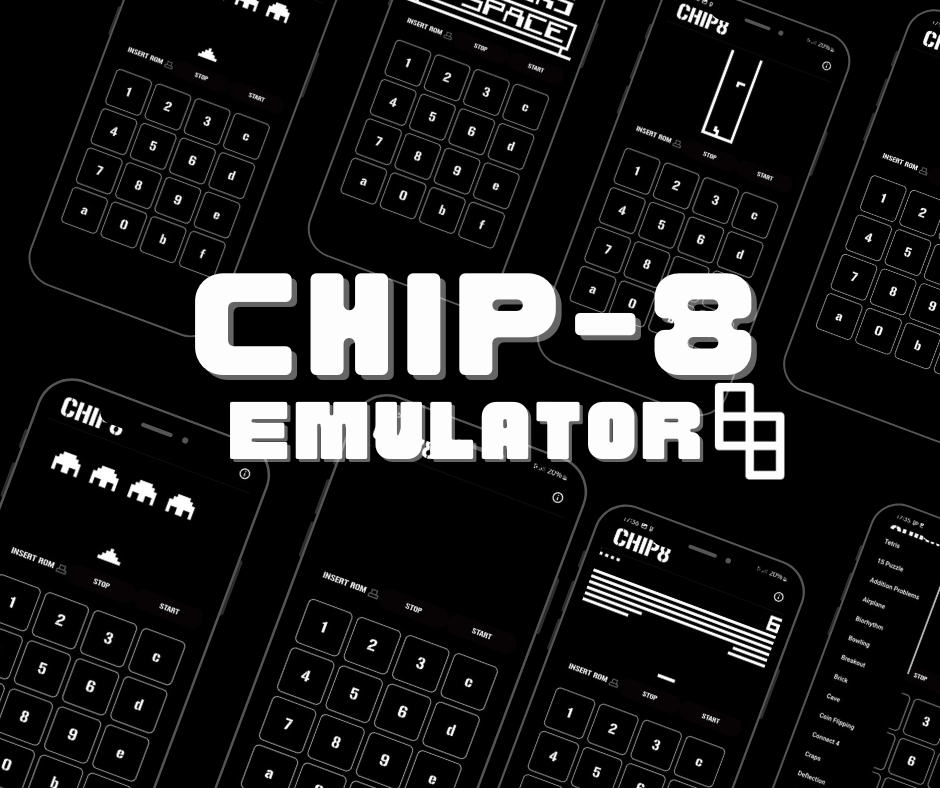
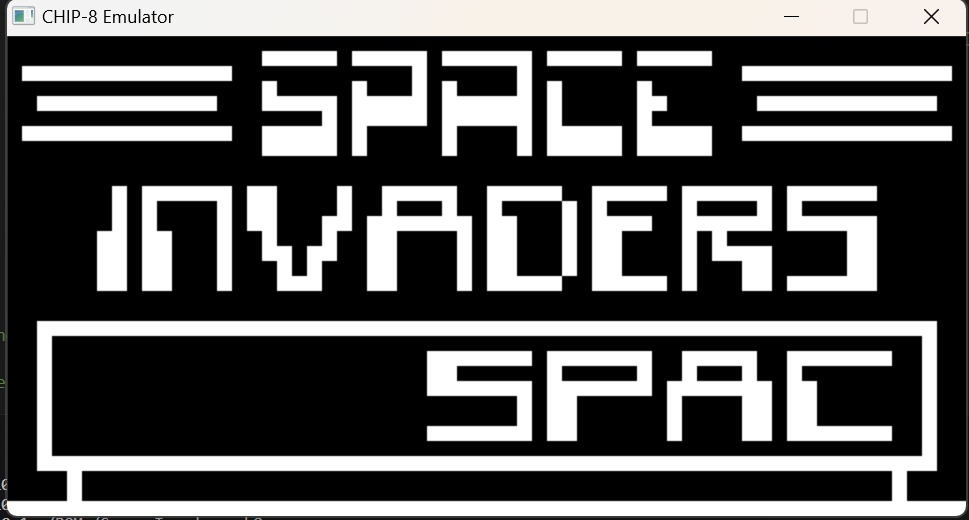
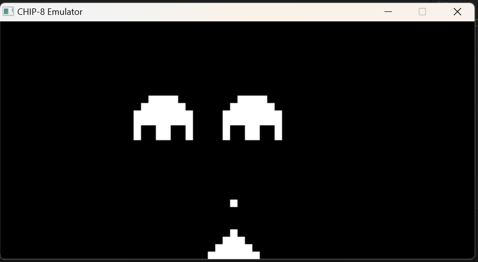
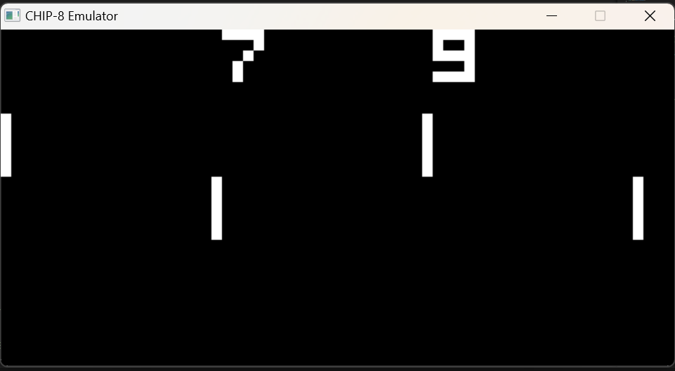
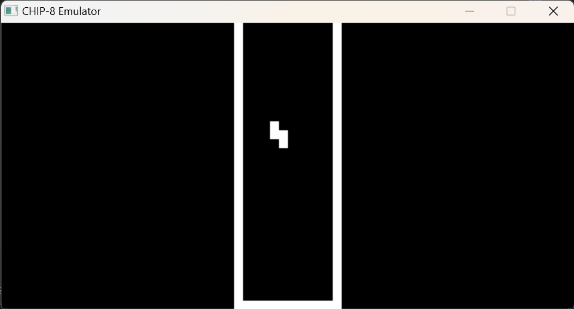

# CHIP-8 EMULATOR 🕹️

This is a Chip-8 compiler designed to emulate and run Chip-8 programs.



### Preview For Computer app
  |                      |          |
| :--------------------------------------------: | :------------------------------------: |
|  |  |


## Overview

The Chip-8 is an interpreted programming language used in the 1970s and early 1980s on early microcomputers. This project aims to provide a compiler that can translate Chip-8 programs into executable code.

## Features

- **Chip-8 Emulation:** Compiles and runs Chip-8 programs.
- **Simple Interface:** Minimal setup to compile and execute programs.

## Getting Started

### Prerequisites


- **C++ compiler**

  - **Linux:** GCC 9
  - **Windows:** MinGW-w64 8.0 (GCC 9.2)
  - **macOS:** Install XCode command line tools

- **SDL2**

  - **Linux:** install using `sudo apt install libsdl2-dev`.
  - **Windows:** download the [SDL2-2.0.10 development libraries](https://www.libsdl.org/download-2.0.php) and place them under a new `external` folder in the root of this project. To run, download the [SDL2 runtime binaries](https://www.libsdl.org/download-2.0.php) and put `SDL2.dll` into the folder with your compiled binary.
  - **macOS:** install using `brew install sdl2`.
 
- **Flutter**
  - You'll need to set up the IDE and mobile device emulator, or any mobile testing device on your local system.

  - **Flutter Environment**: You'll need to have the following installed:
      1. [Flutter SDK](https://flutter.dev/docs/get-started/install)
      2. [Android Studio](https://developer.android.com/studio)

  - ***Ensure you are testing the app using Flutter version [3.0.1](https://docs.flutter.dev/development/tools/sdk/releases?tab=windows) and above.***

    For checking flutter version:
      - Run `flutter --version` in terminal

  If your version is not upto date, follow these steps to upgrade:
      - `flutter channel stable` to switch to the channel having stable version of flutter updates
      - `flutter upgrade` to get the latest flutter version
    
### Building
Clone the repository into your system and go to the root directory of the project.
```console
git clone https://github.com/imperialrogers/CHIP-8.git
```

```console
cd CHIP-8
```

#### Windows

Go to the source-code folder.
```console
cd source-code/
```
Just Run the following command in root directory.

```console
g++ -I src/include -L src/lib main.cpp Chip8.cpp Platform.cpp -lmingw32 -lSDl2main -lSDl2 -o chip8
```

### Mobile
Go to the flutter source folder.
```console
cd flutter/chip8/
```
Run the following command in root directory.

```console
flutter build apk
```

```console
flutter install
```

## Usage

`./chip8 <Scale> <Delay> <ROM>`

- Some ROMs are provided in the /ROMs directory.

`Download Mobile APK`

- You can download the mobile apk from [RELEASES](https://github.com/imperialrogers/CHIP-8/releases/tag/v0.0.0) section or from the given link: [DOWNLOAD APK](https://github.com/imperialrogers/CHIP-8/releases/download/v0.0.0/Chip8.apk)

## Contributing

Whether you have some feauture requests/ideas, code improvements, refactoring, performance improvements, help is always Welcome. The more is done, better it gets.

If you found any bugs, consider opening an [issue](https://github.com/imperialrogers/CHIP-8/issues/new).

## References

- [Emulator 101 Reference](http://emulator101.com/)

- [Timendus' Chip-8 Test Suite](https://github.com/Timendus/chip8-test-suite)
  
- [CHIP-8 on Wikipedia](https://en.wikipedia.org/wiki/CHIP-8)

- [Cowgod's Chip-8 Technical Reference v1.0](http://devernay.free.fr/hacks/chip8/C8TECH10.HTM)

- [Austin Morlan's Building a Chip-8 Emulator(C++)](https://austinmorlan.com/posts/chip8_emulator/#source-code)

- [Explanation of differing opcode behaviours on CHIP8/CHIP-48/SCHIP](https://www.reddit.com/r/programming/comments/3ca4ry/writing_a_chip8_interpreteremulator_in_c14_10/csuepjm/)

- [MDN Web Docs](https://developer.mozilla.org/en-US/docs/WebAssembly/C_to_wasm)
